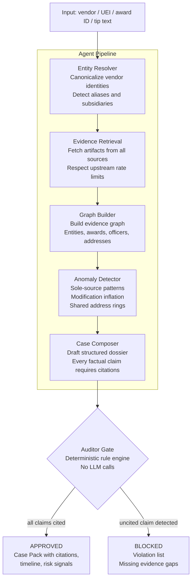
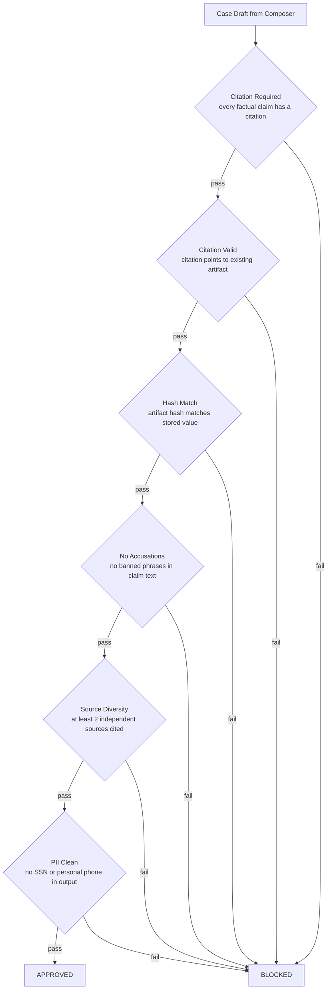
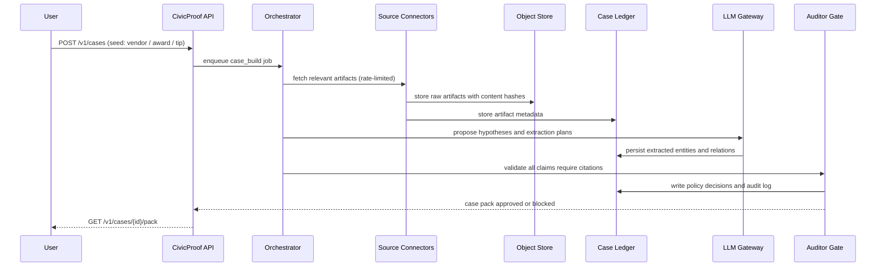
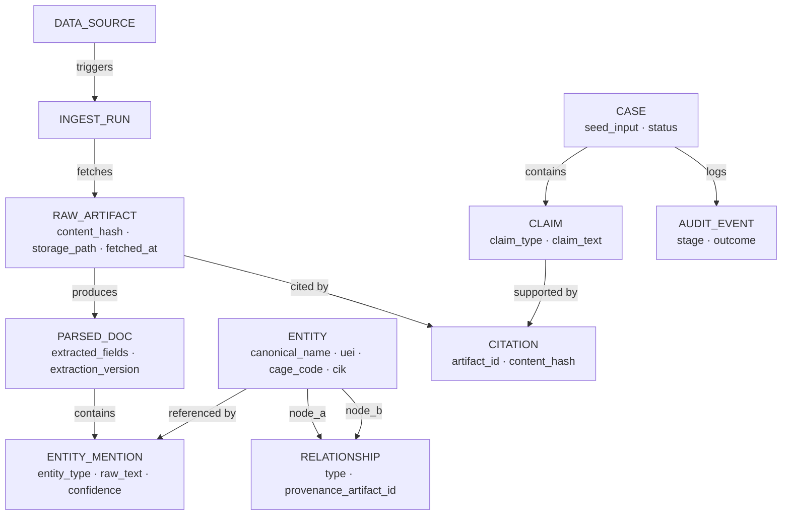
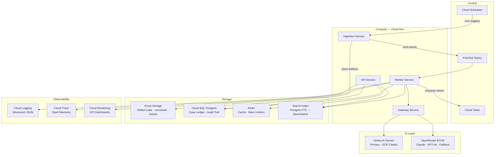

<div align="center">

# CivicProof

**Agentic investigative control plane for federal spending transparency**

Turn a vendor name, UEI, CAGE code, award ID, or insider tip into an evidence-grounded,
citation-rich, complaint-ready case pack — assembled entirely from public federal data.

[](https://www.python.org)
[](LICENSE)
[](https://github.com/d3v07/civicproof/actions)
[](#testing)
[](https://cloud.google.com/run)
[](#llm-gateway)

[**Quick Start**](#quick-start) • [**Architecture**](#architecture) • [**API Reference**](#api-reference) • [**Contributing**](#contributing)

</div>

---

## What is CivicProof?

CivicProof is a **governance-first, multi-agent investigative system** that automates the most time-consuming part of federal fraud investigation: evidence assembly.

Investigators, journalists, and attorneys currently spend weeks manually pulling documents from USAspending, SEC EDGAR, DOJ press releases, and IG reports — then stitching them together by hand. CivicProof compresses that into minutes, while enforcing a hard rule that makes it defensible in legal and editorial contexts:

> **Every factual claim in a case pack must cite a stored artifact with a verifiable content hash — or it is blocked.**

No hallucinations reach the output. The system is built to withstand scrutiny.

---

## Key Properties

| Property | Description |
|----------|-------------|
| **Evidence-grounded by construction** | Every factual claim requires a citation pointing to a stored, hashed artifact. The Auditor Gate blocks anything unsupported. |
| **Governance-first architecture** | Policy controls, tool permissioning, PII redaction, and strict separation between "risk signals" and "accusations". |
| **Multi-model routing** | Vertex AI Gemini as primary (GCP credits), OpenRouter BYOK as fallback, local vLLM for dev. Provider-aware budgets and rate limits. |
| **Reproducible audit trails** | Same seed + same artifact snapshot always produces the same case pack hash. Every decision is logged. |
| **Near-zero idle cost** | Serverless GCP (Cloud Run, min instances = 0). Costs ~$0 when not processing cases. |
| **Production-grade observability** | OpenTelemetry traces, structured JSON logs queryable by `case_id`, Cloud Monitoring dashboards. |

---

## Architecture

CivicProof is designed as four independent planes. Each plane scales and fails independently.

```mermaid
flowchart LR
    subgraph SRC["Data Sources"]
        U1["USAspending.gov"]
        U2["SAM.gov"]
        U3["SEC EDGAR"]
        U4["DOJ API"]
        U5["Oversight.gov"]
        U6["OpenFEC"]
    end
    subgraph ING["Ingestion Plane"]
        SCH["Scheduler + Source Quotas"]
        WRK["Ingest Workers"]
        Q["Event Stream"]
    end
    subgraph EV["Evidence Plane"]
        OBJ["Artifact Store\nimmutable + versioned"]
        DB["Case Ledger\nPostgres"]
        IDX["Search Index"]
        GR["Evidence Graph"]
        KV["Cache + Rate Counters"]
    end
    subgraph AG["Agentic Control Plane"]
        ORCH["Multi-Agent Orchestrator"]
        GW["LLM Gateway\nVertex AI + OpenRouter"]
        AUD["Auditor Gate\ndeterministic"]
        EVAL["Eval + Red-Team Harness"]
    end
    subgraph SRV["Serving Plane"]
        API["REST API"]
        UI["Case Pack Viewer"]
        DASH["KPI Dashboards"]
    end
    SRC -->|"rate-limited pulls"| ING
    ING --> EV
    EV --> AG
    AG --> SRV
```



> [View interactive diagram in FigJam →](https://www.figma.com/online-whiteboard/create-diagram/b543286d-3e33-4281-a0fe-b49df4727adc)

---

## Multi-Agent Pipeline

A case is built by six agents in sequence. Each step is idempotent, logged, and budget-controlled. The final gate is deterministic — no LLM involved.



> [View interactive diagram in FigJam →](https://www.figma.com/online-whiteboard/create-diagram/0fff82a1-70e8-4d5d-bd63-a5a27c5e0eb2)

---

## Auditor Gate

The Auditor Gate is the central governance mechanism. It is a **pure deterministic function** — no model calls, no network calls, no exceptions. Every case pack passes through it before reaching output.



> [View interactive diagram in FigJam →](https://www.figma.com/online-whiteboard/create-diagram/f1a78375-8dcc-4f51-a879-73de9b3db2d1)

---

## Data Sources

All six sources are public and free. Rate limits are encoded in the system — not documented separately.

| Source | Data | Rate Limit | Key Required |
|--------|------|------------|--------------|
| [USAspending.gov](https://api.usaspending.gov) | Federal awards, contracts, grants, subawards | 5 RPS (courtesy) | No |
| [SAM.gov](https://open.gsa.gov/api/get-opportunities-public-api/) | Contract opportunities, vendor registrations | 4 RPS | Yes |
| [SEC EDGAR](https://www.sec.gov/developer) | Corporate filings, 10-K, 10-Q, 8-K, DEF 14A | **10 RPS strict** | No |
| [DOJ Press Releases](https://www.justice.gov/developer) | Enforcement actions, FCA settlements | 4 RPS | No |
| [Oversight.gov](https://www.oversight.gov) | Inspector General reports, recommendations | 2 RPS (courtesy) | No |
| [OpenFEC](https://api.open.fec.gov) | Political contributions, committee filings | 1,000 calls/hr | Yes |

---

## Request Flow



> [View interactive diagram in FigJam →](https://www.figma.com/online-whiteboard/create-diagram/8ba522c5-3f7e-4f73-a76a-d81aece17843)

---

## Data Model



> [View interactive diagram in FigJam →](https://www.figma.com/online-whiteboard/create-diagram/6ae4647d-95ae-4f55-bbab-b3ac615df6de)

---

## Infrastructure



> [View interactive diagram in FigJam →](https://www.figma.com/online-whiteboard/create-diagram/61ec6044-eea3-4d2c-8042-d34bc6bfc4d7)

---

## LLM Gateway

The gateway treats model providers as unreliable dependencies with quotas and outages — not as magical oracles.

| Task | Primary | Fallback | Max Cost/Call |
|------|---------|----------|---------------|
| Extraction | `gemini-2.0-flash` | `claude-3.5-haiku` | $0.005 |
| Analysis | `gemini-2.0-pro` | `claude-sonnet-4` | $0.020 |
| Composition | `gemini-2.0-pro` | `gpt-4o` | $0.050 |
| Embeddings | `text-embedding-005` | `sentence-transformers` | $0.001 |

**Budget controls**: $0.50 per case, $5.00 per day — enforced via Redis token counters.
**Caching**: Response cache keyed by `SHA-256(model + prompt + schema)`. TTL: 1-24h by task type.
**Structured outputs**: All factual outputs use JSON schema enforcement. Refusals are detectable programmatically.

---

## Quick Start

### Prerequisites

- Python 3.11+
- Docker + Docker Compose
- `make`

### 1. Clone and configure

```bash
git clone https://github.com/d3v07/civicproof.git
cd civicproof
cp .env.example .env
# Edit .env — add your SAM.gov, OpenFEC, and OpenRouter keys
```

### 2. Start local dev stack

```bash
make dev-up
# Starts: Postgres, MinIO, Redis, Redpanda, Jaeger
```

### 3. Run migrations and seed data sources

```bash
make migrate
make seed-sources
```

### 4. Run your first case

```bash
# Trigger a case from a vendor name
curl -X POST http://localhost:8000/v1/cases \
  -H "Content-Type: application/json" \
  -d '{"seed": "Booz Allen Hamilton", "seed_type": "vendor_name"}'

# Poll for status
curl http://localhost:8000/v1/cases/{case_id}

# Download approved case pack
curl http://localhost:8000/v1/cases/{case_id}/pack
```

### 5. Run tests

```bash
make test           # unit + contract tests
make test-coverage  # with coverage report (gate: 80%)
make eval           # full eval harness (grounding + hallucination + retrieval)
```

---

## API Reference

| Method | Endpoint | Description |
|--------|----------|-------------|
| `POST` | `/v1/cases` | Create a case from a seed (vendor name, UEI, CAGE, award ID, or tip text) |
| `GET` | `/v1/cases/{id}` | Get case status and summary |
| `GET` | `/v1/cases/{id}/pack` | Download audited case pack as JSON. Returns 404 if blocked by Auditor. |
| `GET` | `/v1/search/entities` | Full-text entity search with autocomplete (`?q=acme&type=vendor`) |
| `GET` | `/v1/search/artifacts` | Full-text evidence search (`?q=false+claims+act&source=doj`) |
| `POST` | `/v1/ingest/runs` | Trigger a controlled backfill run for a specific source |
| `GET` | `/v1/metrics/public` | Live system KPIs — dossier pass rate, cost per case, hallucination caught rate |

Full OpenAPI spec available at `/docs` when the API service is running.

---

## Tech Stack

| Layer | Local Dev | GCP Production |
|-------|-----------|----------------|
| Compute | `uvicorn` direct | Cloud Run (min instances = 0) |
| Events | Redpanda | Cloud Pub/Sub + Cloud Tasks |
| Database | Postgres 16 | Cloud SQL Postgres |
| Object store | MinIO | Cloud Storage + Object Lock |
| Search | Postgres FTS | OpenSearch (scale path) |
| Cache | Redis 7 | Memorystore / Upstash |
| LLM | vLLM local | Vertex AI Gemini + OpenRouter |
| Tracing | Jaeger | Cloud Trace (OpenTelemetry) |
| Metrics | Prometheus | Cloud Monitoring |

---

## Testing

The test suite is layered to catch failures at the right level:

```
tests/
  unit/         parsers, normalizers, hashing, policy rules, rate limiter
  contract/     upstream API response shapes, Pub/Sub event schemas
  integration/  full tip-to-dossier pipeline on local emulators
  e2e/          end-to-end on deployed GCP environment
  red_team/     adversarial prompt injection, budget cap enforcement
```

**Coverage gate**: 80% minimum across all packages.

**Eval harness release gates** (must pass before any deploy):

| Metric | Threshold |
|--------|-----------|
| Audited dossier pass rate | ≥ 95% |
| Hallucination block rate | ≥ 95% |
| Retrieval recall@10 | ≥ 80% |
| Replay determinism | 100% |
| Cost per case | ≤ $1.00 |

---

## Repository Structure

```
civicproof/
├── services/
│   ├── api/          REST API — public + internal endpoints (FastAPI)
│   ├── worker/       Async pipeline worker — Pub/Sub consumer + 6 agents
│   └── gateway/      LLM gateway — routing, caching, budget, content filter
├── packages/
│   ├── common/       Shared schemas, event contracts, hashing, rate limiter
│   └── eval/         Eval harness, synthetic fraud generators, red-team suite
├── infra/
│   └── terraform/    GCP infrastructure as code
├── tests/            Unit, contract, integration, e2e, red_team
├── .github/
│   └── workflows/    CI (lint + test + eval gate + deploy)
└── docker-compose.dev.yml
```

---

## Security

- **No secrets in code** — `.env` locally, GCP Secret Manager in production
- **Prompt injection defenses** — content filter pre-screens all inputs before LLM calls
- **Rate limit compliance** — upstream limits encoded per-source in the system
- **PII redaction** — aligned with USAspending exclusion policies
- **Audit trails** — NIST SP 800-92 aligned log management
- **Least-privilege IAM** — dedicated service account per Cloud Run service
- **Output governance** — system outputs "risk signals" and "hypotheses" only, never accusations

---

## Contributing

```bash
# Branch naming
feat/S2-usaspending-connector
fix/S3-doj-parser-pagination
test/S6-hallucination-eval-suite

# Commit format
feat(worker): add USAspending V2 award connector with idempotent pagination
fix(gateway): enforce 10 RPS rate limit for SEC EDGAR
test(eval): add shell vendor ring synthetic fraud dataset
```

All PRs require: lint pass, test pass (80% coverage), contract tests pass, 1 review approval.

---

## License

MIT © [d3v07](https://github.com/d3v07)
